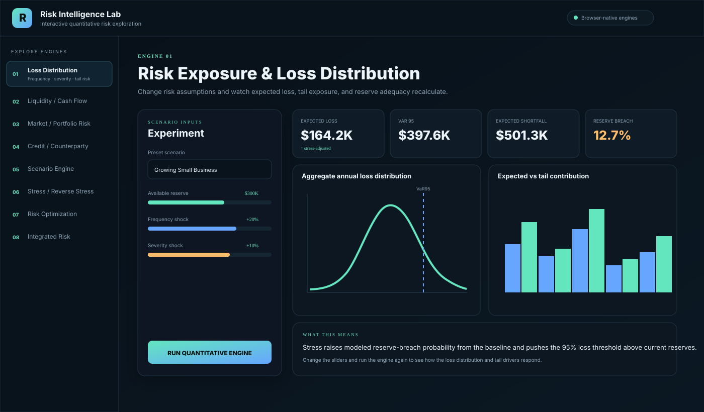

# Risk Intelligence Lab

**A browser-first quantitative risk laboratory powered by eight embedded Python engines.**



The portfolio is designed to be **used**, not just read. A user chooses a risk engine, selects a scenario, changes assumptions, runs the model, and immediately sees the calculated metrics and visual response.

## What is interactive

The browser interface exposes real model inputs such as:

- reserves and risk tolerance;
- loss-frequency and loss-severity shocks;
- cash and liquidity thresholds;
- portfolio correlation and risk horizon;
- PD and LGD stress;
- systemic scenario shocks;
- reverse-stress risk capacity;
- optimization budgets and risk limits;
- cross-risk dependency strength.

Each change is passed to the underlying Python engine. The engine recalculates the scenario and returns new KPI cards, distributions, contribution charts, stress curves, or optimization frontiers.

## Run the browser lab now

No Python package installation is required for the interactive interface.

From the repository root:

```bash
python -m http.server 8000
```

Then open:

```text
http://localhost:8000/web/
```

The page loads Pyodide, NumPy, pandas, SciPy and the repository's Python engine source into the browser. Calculations run locally in the browser.

## Public web deployment

A GitHub Pages deployment workflow is included in `.github/workflows/pages.yml`.

The repository currently needs GitHub Pages enabled once before that workflow can publish. In GitHub:

**Settings → Pages → Source → GitHub Actions**

Then run:

**Actions → Deploy interactive Risk Intelligence Lab → Run workflow**

The resulting site will be served from the repository's GitHub Pages URL.

## One interface, eight engines

| # | Engine | Experiment with |
|---:|---|---|
| 01 | [Risk Exposure & Loss Distribution](engines/01-risk-exposure-loss-distribution/) | Frequency/severity, aggregate loss, VaR/ES, reserve adequacy |
| 02 | [Liquidity / Cash-Flow-at-Risk](engines/02-liquidity-cashflow-risk/) | Cash paths, liquidity breach, insolvency, buffer requirements |
| 03 | [Market / Portfolio Risk](engines/03-market-portfolio-risk/) | Correlation, fat tails, VaR/ES, drawdown, attribution |
| 04 | [Credit / Counterparty Risk](engines/04-credit-counterparty-risk/) | PD/LGD/EAD, correlated defaults, concentration, reserve stress |
| 05 | [Monte Carlo Scenario Engine](engines/05-monte-carlo-scenario-engine/) | Continuous drivers, dependency, target miss, downside outcomes |
| 06 | [Stress & Reverse Stress](engines/06-stress-reverse-stress/) | Forward shocks, nonlinear interactions, reverse-stress boundary |
| 07 | [Risk-Constrained Optimization](engines/07-risk-constrained-optimization/) | Budget, risk limit, allocation, efficient frontier |
| 08 | [Integrated Risk / Dependency](engines/08-integrated-risk-dependency/) | Cross-risk aggregation, diversification, dependency stress |

## Architecture

```text
web/
├── index.html          # only user-facing interface
├── styles.css
├── app.js              # controls, navigation, Plotly rendering
└── bridge.py           # browser-to-engine Python adapter
          │
          ▼
engines/
├── 01-risk-exposure-loss-distribution/
├── 02-liquidity-cashflow-risk/
├── 03-market-portfolio-risk/
├── 04-credit-counterparty-risk/
├── 05-monte-carlo-scenario-engine/
├── 06-stress-reverse-stress/
├── 07-risk-constrained-optimization/
└── 08-integrated-risk-dependency/
```

There is deliberately **no standalone application inside an engine directory**.

The browser loads the actual Python engine source and executes it through Pyodide. The web layer owns presentation and interaction; the engine layer owns mathematics.

## Scale

The lab is size-agnostic:

**individual / household → solo professional → small business → mid-market organization → large organization**

The model changes with exposure and complexity, not headcount.

## Validation

Each engine has its own tests and validation report. CI validates all eight engines independently and also verifies the browser application bundle and JavaScript/Python bridge source.

All included scenarios are synthetic demonstrations. Model outputs are conditional on the assumptions entered and are not forecasts or professional advice.
